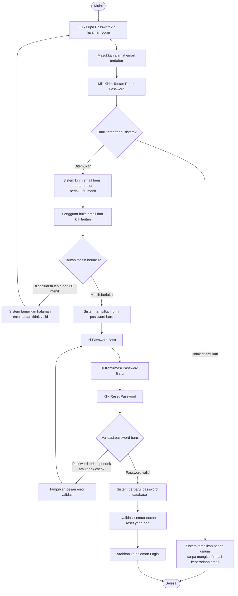

# AD-03: Reset Password

## Informasi Diagram

| Atribut | Nilai |
|---------|-------|
| **Kode** | AD-03 |
| **Nama Proses** | Reset Password (Lupa Password) |
| **Aktor** | Warga / Admin / Petugas Desa |
| **Use Case Terkait** | UC-07 |
| **Panduan Pengguna** | [Lupa Password Warga](../../guides/warga/03-password-reset.md) · [Lupa Password Admin](../../guides/admin/15-password-reset.md) |

## Deskripsi

Proses ini menggambarkan alur aktivitas saat pengguna lupa password dan ingin menggantinya melalui tautan yang dikirim ke email. Proses melibatkan dua tahap: (1) permintaan tautan reset, dan (2) pengaturan password baru menggunakan tautan tersebut.

**Prasyarat:** Pengguna memiliki akun dengan email yang terdaftar di sistem.

**Hasil:** Password akun berhasil diperbarui dan pengguna dapat login dengan password baru.

## Diagram Aktivitas

## Penjelasan Alur

| Langkah | Aktivitas | Keterangan |
|---------|-----------|------------|
| 1 | Klik Lupa Password? | Pengguna mengakses fitur reset dari halaman login |
| 2 | Masukkan email | Pengguna memasukkan email yang terdaftar |
| 3 | Kirim tautan | Sistem mengirim email dengan tautan reset berumur 60 menit |
| 4 | Klik tautan | Pengguna membuka tautan dari email |
| 5 | Verifikasi tautan | Sistem mengecek apakah tautan masih valid |
| 6 | Isi password baru | Pengguna memasukkan dan mengkonfirmasi password baru |
| 7 | Perbarui password | Sistem menyimpan password baru (terenkripsi) |
| 8 | Redirect login | Pengguna diarahkan ke halaman login |

## Kondisi Alternatif (Error)

| Kondisi | Penyebab | Tindakan Sistem |
|---------|----------|-----------------|
| Email tidak ditemukan | Email tidak terdaftar | Pesan umum ditampilkan (tidak mengkonfirmasi email ada/tidak) |
| Tautan kadaluarsa | Lebih dari 60 menit sejak dikirim | Halaman error, pengguna harus minta tautan baru |
| Password tidak valid | Terlalu pendek atau tidak cocok | Pesan error validasi pada form |
