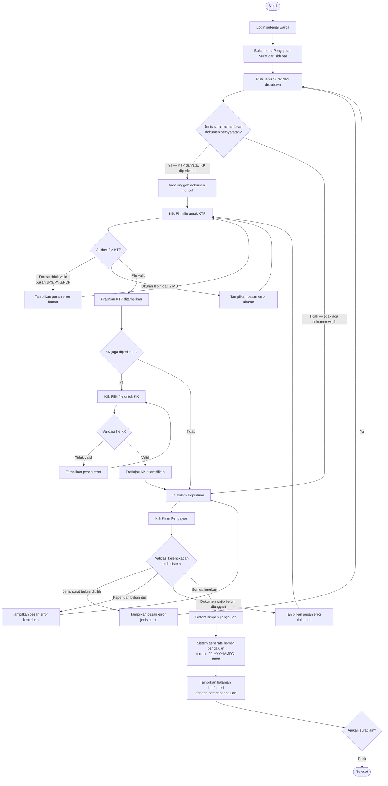

# AD-04: Pengajuan Surat Keterangan

## Informasi Diagram

| Atribut | Nilai |
|---------|-------|
| **Kode** | AD-04 |
| **Nama Proses** | Pengajuan Surat Keterangan |
| **Aktor** | Warga |
| **Use Case Terkait** | UC-09, UC-10 |
| **Panduan Pengguna** | [Pengajuan Surat](../../guides/warga/05-pengajuan-surat-form.md) · [Unggah Dokumen](../../guides/warga/06-pengajuan-surat-dokumen.md) · [Validasi Kelengkapan](../../guides/warga/07-pengajuan-surat-kelengkapan.md) |

## Deskripsi

Proses ini menggambarkan alur aktivitas saat warga yang sudah login mengajukan permohonan surat keterangan secara online. Proses mencakup pemilihan jenis surat, pengunggahan dokumen persyaratan (KTP/KK), pengisian keperluan, validasi kelengkapan oleh sistem, hingga nomor pengajuan diterbitkan.

**Prasyarat:** Warga sudah login dan admin telah mengisi master data jenis surat.

**Hasil:** Pengajuan tersimpan di sistem dengan nomor pengajuan unik (format: `PJ-YYYYMMDD-####`).

## Diagram Aktivitas

## Penjelasan Alur

| Langkah | Aktivitas | Keterangan |
|---------|-----------|------------|
| 1 | Login | Warga harus sudah terautentikasi |
| 2 | Pilih jenis surat | Dropdown berisi jenis surat aktif dari master data |
| 3 | Unggah dokumen | Muncul hanya jika jenis surat memerlukan KTP/KK |
| 4 | Validasi file | Sistem cek format (JPG/PNG/PDF) dan ukuran (maks. 2 MB) |
| 5 | Isi keperluan | Deskripsi tujuan pengajuan surat |
| 6 | Validasi kelengkapan | Sistem cek semua field wajib terisi |
| 7 | Simpan & nomor | Pengajuan tersimpan, nomor unik digenerate |
| 8 | Konfirmasi | Halaman konfirmasi dengan nomor pengajuan ditampilkan |

## Kondisi Alternatif (Error)

| Kondisi | Penyebab | Tindakan Sistem |
|---------|----------|-----------------|
| Format file tidak valid | File bukan JPG/PNG/PDF | Pesan error pada field unggah |
| Ukuran file > 2 MB | File terlalu besar | Pesan error pada field unggah |
| Jenis surat tidak dipilih | Field kosong | Pesan error validasi |
| Keperluan tidak diisi | Field kosong | Pesan error validasi |
| Dokumen wajib belum diunggah | File belum dipilih | Pesan error validasi |
