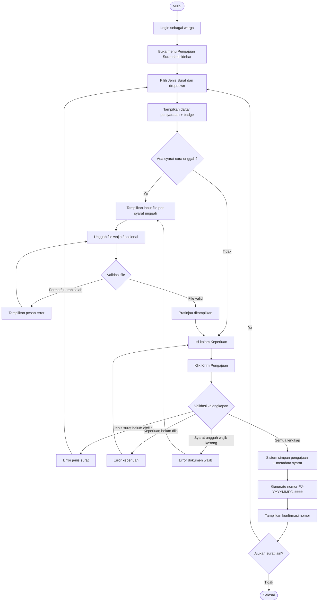

# AD-04: Pengajuan Surat Keterangan

## Informasi Diagram

| Atribut | Nilai |
|---------|-------|
| **Kode** | AD-04 |
| **Nama Proses** | Pengajuan Surat Keterangan |
| **Aktor** | Warga |
| **Use Case Terkait** | UC-09, UC-10 |
| **Panduan Pengguna** | [Pengajuan Surat](../../guides/warga/05-pengajuan-surat-form.md) · [Unggah Dokumen](../../guides/warga/06-pengajuan-surat-dokumen.md) · [Validasi Kelengkapan](../../guides/warga/07-pengajuan-surat-kelengkapan.md) |

## Deskripsi

Proses ini menggambarkan alur aktivitas saat warga yang sudah login mengajukan permohonan surat keterangan secara online. Proses mencakup pemilihan jenis surat, daftar persyaratan ber-badge (unggah / bawa kantor / informasi), pengunggahan file hanya untuk syarat unggah, pengisian keperluan, validasi kelengkapan (`is_wajib`), hingga nomor pengajuan diterbitkan.

**Prasyarat:** Warga sudah login dan admin telah mengisi master data jenis surat beserta baris persyaratan terstruktur.

**Hasil:** Pengajuan tersimpan di sistem dengan nomor pengajuan unik (format: `PJ-YYYYMMDD-####`).

## Diagram Aktivitas

## Penjelasan Alur

| Langkah | Aktivitas | Keterangan |
|---------|-----------|------------|
| 1 | Login | Warga harus sudah terautentikasi |
| 2 | Pilih jenis surat | Dropdown jenis surat aktif |
| 3 | Baca badge | Wajib diunggah / Boleh dikosongkan / Bawa ke kantor / Informasi |
| 4 | Unggah dokumen | Hanya untuk cara **unggah**; label = nama syarat |
| 5 | Validasi file | Format JPG/PNG/PDF, maks. 2 MB |
| 6 | Isi keperluan | Tujuan pengajuan |
| 7 | Validasi kelengkapan | Hanya syarat unggah wajib yang memblokir |
| 8 | Simpan & nomor | Status `diajukan`, nomor unik |

## Kondisi Alternatif (Error)

| Kondisi | Penyebab | Tindakan Sistem |
|---------|----------|-----------------|
| Dokumen wajib kosong | Syarat unggah `is_wajib` tanpa file | Pesan “Dokumen {nama} wajib diunggah.” — tidak menyimpan |
| Format/ukuran salah | Bukan JPG/PNG/PDF atau > 2 MB | Pesan error pada kolom file |
| Jenis / keperluan kosong | Field wajib form | Pesan validasi Bahasa Indonesia |
