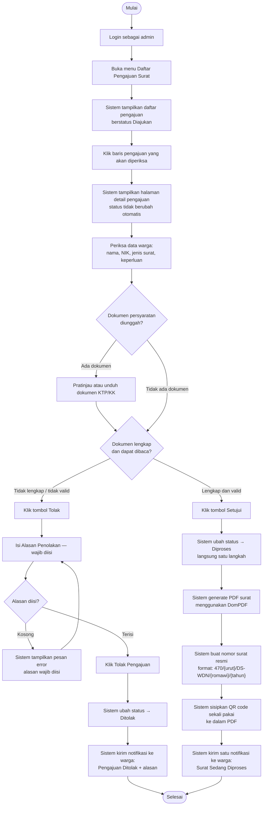

# AD-05: Verifikasi Pengajuan oleh Admin

## Informasi Diagram

| Atribut | Nilai |
|---------|-------|
| **Kode** | AD-05 |
| **Nama Proses** | Verifikasi Pengajuan oleh Admin |
| **Aktor** | Admin / Petugas Desa |
| **Use Case Terkait** | UC-17, UC-22, UC-23, UC-24 |
| **Panduan Pengguna** | [Verifikasi Pengajuan](../../guides/admin/04-verifikasi-pengajuan.md) · [Generate Surat PDF](../../guides/admin/06-generate-surat-pdf.md) |

## Deskripsi

Proses ini menggambarkan alur aktivitas saat admin/petugas desa memeriksa pengajuan surat yang masuk dan mengambil keputusan setujui atau tolak. Jika disetujui, sistem secara otomatis membuat PDF surat, nomor surat resmi, QR code, dan mengirim notifikasi ke warga. Jika ditolak, warga mendapat notifikasi beserta alasan.

**Prasyarat:** Terdapat pengajuan dengan status **Diajukan** yang menunggu verifikasi.

**Hasil:** Status pengajuan berubah menjadi **Diproses** (jika disetujui) atau **Ditolak** (jika ditolak).

## Diagram Aktivitas

## Penjelasan Alur

| Langkah | Aktivitas | Keterangan |
|---------|-----------|------------|
| 1 | Buka daftar pengajuan | Admin membuka menu Daftar Pengajuan Surat |
| 2 | Pilih pengajuan | Klik baris untuk membuka detail; status tidak berubah saat dibuka |
| 3 | Periksa data | Admin membaca data warga, jenis surat, keperluan |
| 4 | Periksa dokumen | Pratinjau atau unduh KTP/KK jika ada |
| 5a (Setujui) | Klik Setujui | Status langsung → Diproses dalam satu langkah |
| 5a | Generate PDF | Sistem buat PDF otomatis menggunakan DomPDF |
| 5a | Nomor resmi | Sistem generate nomor surat berurutan |
| 5a | QR code | Sistem sisipkan QR sekali pakai ke PDF |
| 5a | Notifikasi | Satu notifikasi dikirim ke warga |
| 5b (Tolak) | Klik Tolak | Admin wajib mengisi alasan penolakan |
| 5b | Notifikasi | Notifikasi + alasan dikirim ke warga |

## Kondisi Alternatif (Error)

| Kondisi | Penyebab | Tindakan Sistem |
|---------|----------|-----------------|
| Alasan tolak kosong | Admin tidak mengisi field alasan | Pesan error, form tidak dapat dikirim |
| Gagal generate PDF | Error penyimpanan atau konfigurasi | Log error sistem; admin perlu mengecek server |
