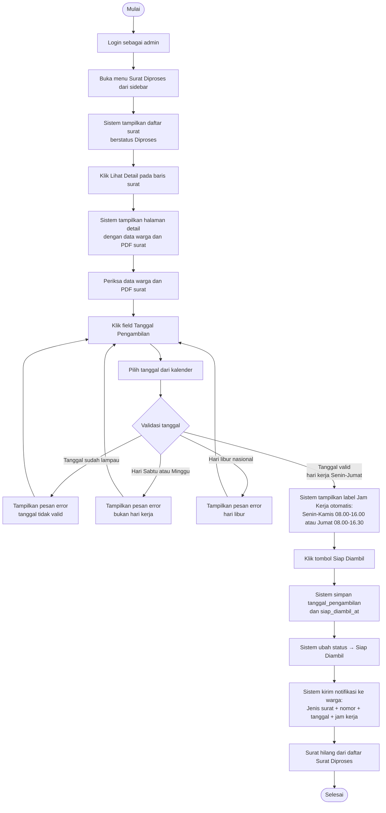

# AD-06: Proses Surat & Penetapan Jadwal Pengambilan

## Informasi Diagram

| Atribut | Nilai |
|---------|-------|
| **Kode** | AD-06 |
| **Nama Proses** | Proses Surat dan Penetapan Jadwal Pengambilan |
| **Aktor** | Admin / Petugas Desa |
| **Use Case Terkait** | UC-18, UC-19, UC-24 |
| **Panduan Pengguna** | [Surat Diproses](../../guides/admin/09-surat-diproses.md) · [Dokumen Siap Diambil](../../guides/admin/10-dokumen-siap-diambil.md) |

## Deskripsi

Proses ini menggambarkan alur aktivitas setelah admin menyetujui pengajuan (surat berstatus **Diproses**). Admin membuka menu Surat Diproses, menetapkan tanggal pengambilan sesuai hari kerja, lalu sistem mengubah status menjadi **Siap Diambil** dan mengirim notifikasi ke warga beserta jadwal.

**Prasyarat:** Pengajuan sudah berstatus **Diproses** (PDF sudah digenerate setelah admin menyetujui).

**Hasil:** Status pengajuan berubah menjadi **Siap Diambil**; warga mendapat notifikasi jadwal pengambilan.

## Diagram Aktivitas

## Penjelasan Alur

| Langkah | Aktivitas | Keterangan |
|---------|-----------|------------|
| 1 | Buka Surat Diproses | Admin membuka menu khusus untuk surat yang sudah disetujui |
| 2 | Lihat detail | Admin memeriksa data dan dapat pratinjau PDF |
| 3 | Pilih tanggal | Admin memilih tanggal pengambilan dari kalender |
| 4 | Validasi tanggal | Sistem menolak tanggal lampau, weekend, dan libur nasional |
| 5 | Jam kerja otomatis | Label jam kerja muncul otomatis berdasarkan hari yang dipilih |
| 6 | Klik Siap Diambil | Admin mengkonfirmasi penetapan jadwal |
| 7 | Simpan & notifikasi | Sistem menyimpan jadwal dan mengirim notifikasi ke warga |

## Kondisi Alternatif (Error)

| Kondisi | Penyebab | Tindakan Sistem |
|---------|----------|-----------------|
| Tanggal lampau | Tanggal sebelum hari ini | Pesan error, tombol Siap Diambil tidak aktif |
| Hari Sabtu/Minggu | Weekend bukan hari kerja | Pesan error |
| Libur nasional | Tanggal masuk daftar libur konfigurasi | Pesan error |
