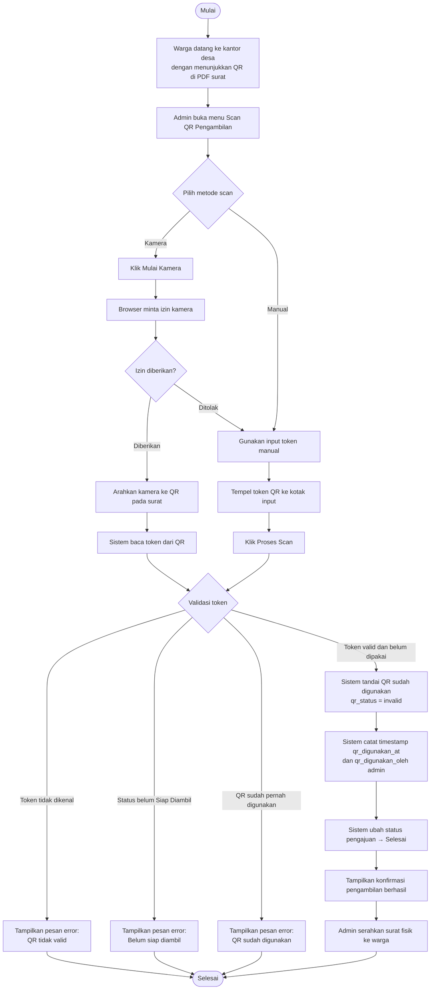

# AD-07: Pengambilan Surat dengan Scan QR

## Informasi Diagram

| Atribut | Nilai |
|---------|-------|
| **Kode** | AD-07 |
| **Nama Proses** | Pengambilan Surat dengan Scan QR |
| **Aktor** | Admin / Petugas Desa |
| **Use Case Terkait** | UC-20 |
| **Panduan Pengguna** | [Scan QR Pengambilan](../../guides/admin/11-qr-sekali-pakai.md) |

## Deskripsi

Proses ini menggambarkan alur aktivitas saat warga datang ke kantor desa untuk mengambil surat yang sudah siap. Admin memindai QR code sekali pakai pada surat PDF milik warga. Setelah scan berhasil, status pengajuan berubah menjadi **Selesai** dan QR tidak bisa digunakan lagi.

**Prasyarat:** Pengajuan berstatus **Siap Diambil** dan warga membawa surat PDF dengan QR code yang masih valid.

**Hasil:** Status pengajuan berubah menjadi **Selesai**; QR code dinonaktifkan; warga mendapat notifikasi.

## Diagram Aktivitas

## Penjelasan Alur

| Langkah | Aktivitas | Keterangan |
|---------|-----------|------------|
| 1 | Warga datang | Warga menunjukkan PDF surat dengan QR code |
| 2 | Buka menu scan | Admin membuka halaman Scan QR Pengambilan |
| 3 | Pilih metode | Kamera (jika didukung browser) atau input token manual |
| 4 | Validasi token | Sistem cek token: dikenal, status valid, belum pernah dipakai |
| 5 | Tandai QR | Token dinonaktifkan, tidak bisa dipakai lagi |
| 6 | Ubah status | Pengajuan → Selesai |
| 7 | Konfirmasi | Layar menampilkan pesan berhasil |
| 8 | Serahkan surat | Admin menyerahkan surat fisik ke warga |

## Kondisi Alternatif (Error)

| Kondisi | Penyebab | Tindakan Sistem |
|---------|----------|-----------------|
| Token tidak dikenal | QR dari surat yang berbeda atau rusak | Pesan error: QR tidak valid |
| Status bukan Siap Diambil | Surat belum ditandai siap diambil | Pesan error: belum siap diambil |
| QR sudah dipakai | Sudah pernah di-scan sebelumnya | Pesan error: QR sudah digunakan |
| Kamera tidak bisa jalan | Browser tidak support atau izin ditolak | Gunakan input token manual |
