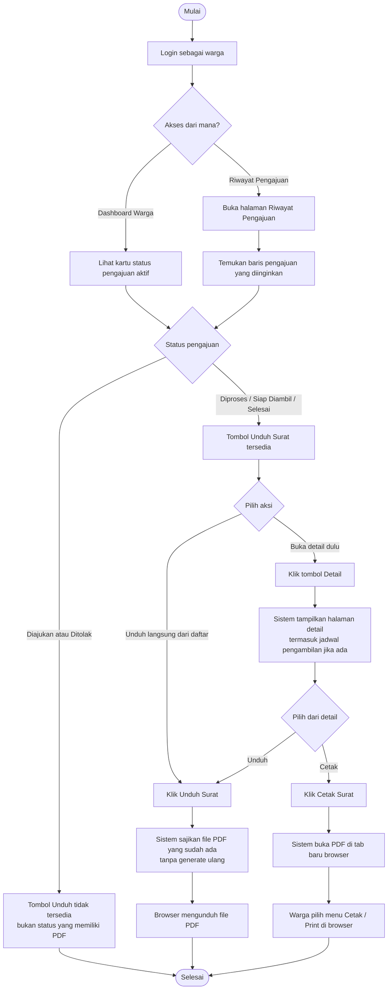

# AD-08: Unduh / Cetak Surat oleh Warga

## Informasi Diagram

| Atribut | Nilai |
|---------|-------|
| **Kode** | AD-08 |
| **Nama Proses** | Unduh dan Cetak Surat oleh Warga |
| **Aktor** | Warga |
| **Use Case Terkait** | UC-13 |
| **Panduan Pengguna** | [Unduh/Cetak Surat](../../guides/warga/10-unduh-surat-warga.md) |

## Deskripsi

Proses ini menggambarkan alur aktivitas saat warga mengunduh atau mencetak file PDF surat keterangan yang sudah diterbitkan oleh admin. Tombol unduh hanya tersedia jika status pengajuan sudah **Diproses**, **Siap Diambil**, atau **Selesai**. Unduh ulang tidak menghasilkan file baru — sistem menyajikan file yang sudah ada.

**Prasyarat:** Pengajuan berstatus Diproses / Siap Diambil / Selesai dan file PDF sudah tersimpan di server.

**Hasil:** File PDF surat terunduh ke perangkat warga atau terbuka di browser untuk dicetak.

## Diagram Aktivitas

## Penjelasan Alur

| Langkah | Aktivitas | Keterangan |
|---------|-----------|------------|
| 1 | Login | Warga harus terautentikasi |
| 2 | Temukan pengajuan | Dari dashboard atau riwayat pengajuan |
| 3 | Cek status | Tombol unduh hanya muncul untuk status tertentu |
| 4 | Pilih aksi | Unduh langsung atau buka detail dulu |
| 5 | Unduh | Sistem menyajikan file yang sudah ada (bukan generate ulang) |
| 6 (opsional) | Cetak | PDF terbuka di tab baru, siap dicetak dari browser |

## Kondisi Alternatif (Error)

| Kondisi | Penyebab | Tindakan Sistem |
|---------|----------|-----------------|
| Status Diajukan/Ditolak | PDF belum digenerate | Tombol unduh tidak ditampilkan |
| File tidak ditemukan di server | Error penyimpanan | Pesan error; warga perlu menghubungi admin |
