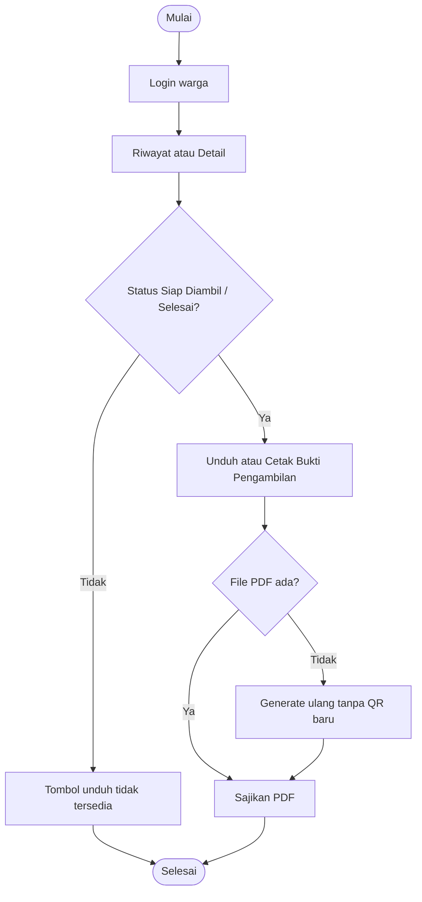

# AD-08: Unduh / Cetak Bukti Pengambilan oleh Warga

## Informasi Diagram

| Atribut | Nilai |
|---------|-------|
| **Kode** | AD-08 |
| **Nama Proses** | Unduh dan Cetak Bukti Pengambilan |
| **Aktor** | Warga |
| **Use Case Terkait** | UC-13 |
| **Panduan Pengguna** | [Unduh/Cetak Bukti Pengambilan](../../guides/warga/10-unduh-surat-warga.md) |

## Deskripsi

Warga mengunduh **Bukti Pengambilan Berkas** (bukan surat keterangan) setelah status **Siap Diambil** atau **Selesai**. PDF berisi jadwal ambil dan QR sekali pakai.

## Diagram Aktivitas

## Kondisi Alternatif

| Kondisi | Tindakan |
|---------|----------|
| Status Diproses / Diajukan / Ditolak | Tombol tidak tampil |
| File hilang | Sistem regenerate dari data surat_terbit |
