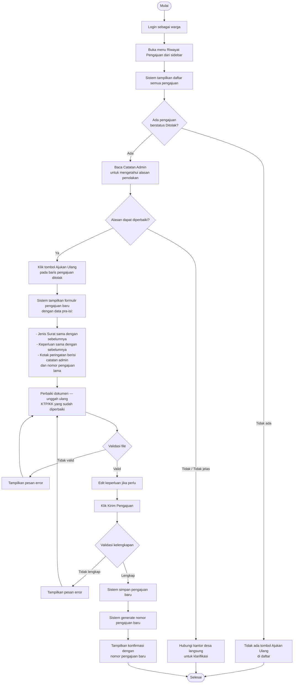

# AD-09: Ajukan Ulang Setelah Ditolak

## Informasi Diagram

| Atribut | Nilai |
|---------|-------|
| **Kode** | AD-09 |
| **Nama Proses** | Ajukan Ulang Pengajuan Setelah Ditolak |
| **Aktor** | Warga |
| **Use Case Terkait** | UC-14 |
| **Panduan Pengguna** | [Ajukan Ulang Pengajuan](../../guides/warga/11-pengajuan-surat-ajukan-ulang.md) |

## Deskripsi

Proses ini menggambarkan alur aktivitas saat warga ingin mengajukan ulang permohonan surat yang sebelumnya ditolak oleh admin. Sistem menyediakan formulir dengan jenis surat dan keperluan yang sudah terisi dari pengajuan lama, sehingga warga hanya perlu memperbaiki dokumen dan mengonfirmasi ulang.

**Prasyarat:** Terdapat pengajuan dengan status **Ditolak** milik warga yang sedang login.

**Hasil:** Pengajuan baru tersimpan dengan nomor pengajuan baru; pengajuan lama tetap ada di riwayat sebagai rekam jejak.

## Diagram Aktivitas

## Penjelasan Alur

| Langkah | Aktivitas | Keterangan |
|---------|-----------|------------|
| 1 | Buka riwayat | Warga membuka halaman Riwayat Pengajuan |
| 2 | Baca catatan admin | Warga membaca alasan penolakan sebelum ajukan ulang |
| 3 | Klik Ajukan Ulang | Tombol hanya tersedia pada baris berstatus Ditolak |
| 4 | Formulir pra-isi | Jenis surat dan keperluan sudah terisi otomatis |
| 5 | Unggah ulang | Warga mengunggah dokumen yang sudah diperbaiki |
| 6 | Kirim | Sistem memvalidasi dan menyimpan pengajuan baru |
| 7 | Nomor baru | Nomor pengajuan baru digenerate; pengajuan lama tetap di riwayat |

## Kondisi Alternatif (Error)

| Kondisi | Penyebab | Tindakan Sistem |
|---------|----------|-----------------|
| Tidak ada pengajuan ditolak | Tidak ada status Ditolak | Tombol Ajukan Ulang tidak muncul |
| Dokumen tidak valid | Format/ukuran tidak sesuai | Pesan error pada field unggah |
| Jenis surat tidak tersedia | Admin telah mengarsipkan jenis surat | Dropdown kosong; warga perlu menghubungi admin |
