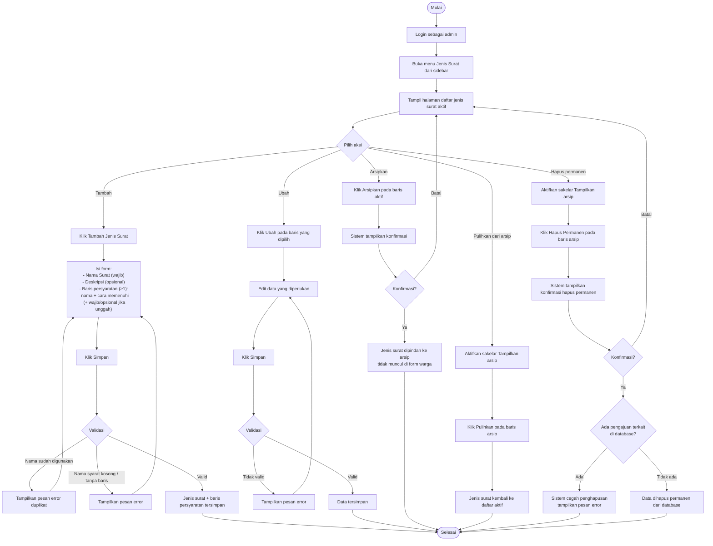

# AD-10: Kelola Master Jenis Surat

## Informasi Diagram

| Atribut | Nilai |
|---------|-------|
| **Kode** | AD-10 |
| **Nama Proses** | Kelola Master Jenis Surat |
| **Aktor** | Admin / Petugas Desa |
| **Use Case Terkait** | UC-16 |
| **Panduan Pengguna** | [Kelola Jenis Surat](../../guides/admin/04-jenis-surat.md) |

## Deskripsi

Proses ini menggambarkan alur aktivitas admin dalam mengelola data master jenis surat keterangan. Admin dapat menambah jenis surat baru (beserta baris persyaratan terstruktur: unggah / bawa kantor / info), mengubah data yang ada, mengarsipkan (soft delete), memulihkan dari arsip, atau menghapus permanen. Data ini digunakan sebagai pilihan warga saat mengajukan surat.

**Prasyarat:** Admin sudah login dan mengakses menu Jenis Surat.

**Hasil:** Data master jenis surat terperbarui sesuai aksi yang dilakukan.

## Diagram Aktivitas

## Penjelasan Alur

| Langkah | Aktivitas | Keterangan |
|---------|-----------|------------|
| Tambah | Buat jenis surat baru | Nama wajib unik; persyaratan dokumen wajib diisi |
| Ubah | Edit data yang ada | Nama tetap harus unik |
| Arsipkan | Soft delete | Data tersimpan di arsip, tidak muncul di form warga |
| Pulihkan | Kembalikan dari arsip | Jenis surat kembali aktif dan bisa dipilih warga |
| Hapus permanen | Hard delete | Hanya dari arsip; gagal jika ada pengajuan terkait |

## Kondisi Alternatif (Error)

| Kondisi | Penyebab | Tindakan Sistem |
|---------|----------|-----------------|
| Nama duplikat | Nama sudah dipakai jenis surat lain | Pesan error duplikat |
| Persyaratan kosong | Field persyaratan tidak diisi | Pesan error validasi |
| Hapus permanen gagal | Ada pengajuan yang mengacu jenis surat ini | Sistem mencegah penghapusan |
