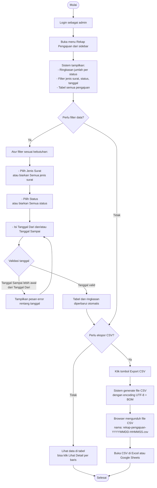

# AD-11: Rekap Pengajuan & Ekspor CSV

## Informasi Diagram

| Atribut | Nilai |
|---------|-------|
| **Kode** | AD-11 |
| **Nama Proses** | Rekap Pengajuan dan Ekspor CSV |
| **Aktor** | Admin / Petugas Desa |
| **Use Case Terkait** | UC-21 |
| **Panduan Pengguna** | [Rekap Pengajuan](../../guides/admin/11-rekap-pengajuan.md) |

## Deskripsi

Proses ini menggambarkan alur aktivitas admin dalam melihat rekap seluruh pengajuan surat, menerapkan filter (jenis surat, status, rentang tanggal), dan mengunduh laporan dalam format CSV. Laporan CSV dapat dibuka di Excel/Google Sheets untuk keperluan pelaporan desa.

**Prasyarat:** Admin sudah login dan terdapat data pengajuan di sistem.

**Hasil:** Admin melihat rekap data sesuai filter dan/atau mendapatkan file CSV laporan.

## Diagram Aktivitas

## Penjelasan Alur

| Langkah | Aktivitas | Keterangan |
|---------|-----------|------------|
| 1 | Buka rekap | Admin membuka halaman Rekap Pengajuan |
| 2 | Lihat ringkasan | Jumlah per status ditampilkan di atas tabel |
| 3 | Terapkan filter | Filter jenis surat, status, dan rentang tanggal |
| 4 | Validasi tanggal | Sistem menolak jika tanggal sampai lebih awal dari tanggal dari |
| 5 | Ekspor CSV | Sistem menghasilkan file CSV dari data yang sudah difilter |
| 6 | Buka CSV | File dibuka di spreadsheet untuk pelaporan |

## Kondisi Alternatif (Error)

| Kondisi | Penyebab | Tindakan Sistem |
|---------|----------|-----------------|
| Tanggal sampai lebih awal | Rentang tanggal tidak valid | Pesan error validasi |
| Tidak ada data | Tidak ada pengajuan yang cocok filter | Tampilkan pesan "tidak ada data" |
| CSV aneh di Excel | Encoding tidak dikenali | Gunakan fitur Import dengan encoding UTF-8 |
