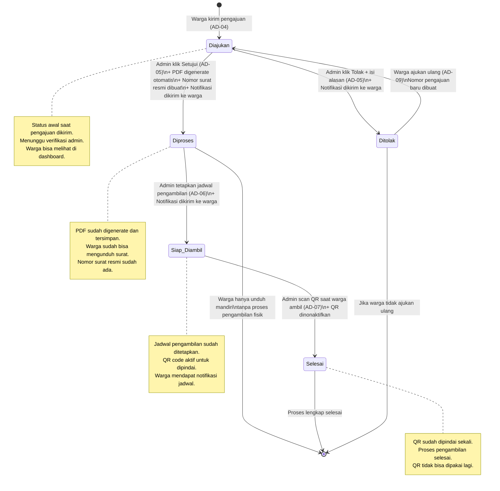

# AD-12: Alur Transisi Status Pengajuan

## Informasi Diagram

| Atribut | Nilai |
|---------|-------|
| **Kode** | AD-12 |
| **Nama Proses** | Transisi Status Pengajuan Surat |
| **Aktor** | Sistem (dipicu oleh Warga dan Admin) |
| **Use Case Terkait** | UC-09, UC-17, UC-19, UC-20, UC-14 |
| **Panduan Pengguna** | [Migrasi Alur Status](../../guides/admin/14-migrasi-alur-status.md) |

## Deskripsi

Diagram ini menggambarkan seluruh kemungkinan transisi status pada sebuah pengajuan surat keterangan — dari saat warga pertama kali mengirim pengajuan hingga proses selesai atau ditolak. Status berubah berdasarkan aksi yang dilakukan oleh warga atau admin.

**Referensi Status:**

| Status | Kode | Dipicu Oleh |
|--------|------|-------------|
| Diajukan | `diajukan` | Warga mengirim pengajuan |
| Diproses | `diproses` | Admin menyetujui pengajuan |
| Siap Diambil | `siap_diambil` | Admin menetapkan jadwal pengambilan |
| Selesai | `selesai` | Admin scan QR saat warga mengambil surat |
| Ditolak | `ditolak` | Admin menolak pengajuan |

## Diagram Transisi Status

## Penjelasan Transisi

| Dari | Ke | Dipicu Oleh | Proses Otomatis |
|------|----|-------------|-----------------|
| — | Diajukan | Warga kirim form pengajuan | Nomor pengajuan `PJ-YYYYMMDD-####` dibuat |
| Diajukan | Diproses | Admin klik Setujui | Generate PDF, nomor surat resmi, QR code, notifikasi warga |
| Diajukan | Ditolak | Admin klik Tolak + isi alasan | Notifikasi ke warga beserta alasan |
| Diproses | Siap Diambil | Admin tetapkan tanggal pengambilan | Notifikasi ke warga beserta jadwal |
| Siap Diambil | Selesai | Admin scan QR saat warga datang | QR dinonaktifkan, timestamp dicatat |
| Ditolak | Diajukan | Warga klik Ajukan Ulang | Nomor pengajuan baru dibuat; pengajuan lama tetap |

## Catatan Khusus

- Status **Disetujui** tidak lagi muncul di alur baru (digabung ke Diproses sejak US-8.4).
- Data lama dengan status `disetujui` di database ditampilkan sebagai **Diproses** di UI.
- Transisi dari **Ditolak → Diajukan** membuat **record pengajuan baru**, bukan mengubah status pengajuan lama.
