# AD-13: Melihat Detail Rekap & Timeline Proses Pengajuan

## Informasi Diagram

| Atribut | Nilai |
|---------|-------|
| **Kode** | AD-13 |
| **Nama Proses** | Melihat Detail Rekap dan Timeline Proses Pengajuan |
| **Aktor** | Admin / Petugas Desa |
| **Use Case Terkait** | UC-21 (ekstensi) |
| **Fitur** | US-8.7 |
| **Panduan Pengguna** | [Detail Rekap & Timeline](../../guides/admin/13-rekap-timeline.md) |

## Deskripsi

Proses ini menggambarkan alur aktivitas saat admin mengakses halaman detail rekap pengajuan untuk melihat riwayat proses kronologis (timeline) suatu pengajuan surat. Sistem mengonstruksi timeline dari beberapa sumber data: `pengajuan_surat.created_at`, `log_verifikasi`, dan `surat_terbit`, lalu menampilkannya dalam format vertikal seperti tracking kurir.

**Prasyarat:** Admin sudah login dan terdapat data pengajuan di sistem.

**Hasil:** Admin dapat membaca seluruh riwayat proses satu pengajuan secara kronologis beserta nama aktor dan waktu WIB.

## Diagram Aktivitas

```mermaid
flowchart TD
    Start([Mulai]) --> A[Login sebagai admin]
    A --> B[Buka halaman Rekap Pengajuan]
    B --> C[Temukan baris pengajuan yang ingin dilihat]
    C --> D[Klik tombol Lihat Detail]
    D --> E[Sistem muat data pengajuan\nbeserta semua relasi:\nuser, jenisSurat, logVerifikasi.admin,\nsuratTerbit.diterbitkanOleh,\nsuratTerbit.qrDigunakanOleh]
    E --> F[Sistem tampilkan halaman detail\n/admin/rekap/id]

    F --> G[Baca bagian Ringkasan Pengajuan:\nnama, NIK, jenis surat,\nnomor pengajuan, nomor surat,\nstatus terakhir]

    G --> H[Sistem bangun timeline dari sumber data]

    H --> I[Poin 1 selalu ada:\nPengajuan Dibuat\nwaktu = pengajuan_surat.created_at\naktor = Sistem]

    I --> J{Status pengajuan?}

    J -->|"Ditolak / ada log_verifikasi tolak"| K[Poin 2b: Ditolak\nwaktu = log_verifikasi.created_at aksi=tolak\naktor = nama admin yang menolak\nalasan dari keterangan log]
    K --> L[Timeline selesai — tidak ada poin lanjutan]
    L --> M[Tampilkan timeline: 2 poin]

    J -->|"Diproses / Siap Diambil / Selesai"| N{Ada log_verifikasi setujui?}
    N -->|"Ada"| O[Poin 2: Disetujui & Surat Diproses\nwaktu = log_verifikasi.created_at aksi=setujui\naktor = nama admin yang menyetujui\nnomor surat dari surat_terbit]
    N -->|"Tidak ada"| P[Lanjut tanpa poin 2]

    O --> Q{Status sudah Siap Diambil\natau Selesai?}
    P --> Q

    Q -->|"Ya"| R{siap_diambil_at ada?}
    R -->|"Ada"| S[Poin 3: Siap Diambil\nwaktu = surat_terbit.siap_diambil_at\naktor = diterbitkanOleh atau diverifikasiOleh\ntanggal + jam kerja label]
    R -->|"Kosong — data lama"| T[Poin 3: Siap Diambil\nestimasi waktu dari surat_terbit.updated_at\ncatatan estimasi ditambahkan ke label]
    S --> U{qr_digunakan_at ada?}
    T --> U
    Q -->|"Tidak"| U

    U -->|"Ada — sudah selesai"| V[Poin 4: Selesai\nwaktu = surat_terbit.qr_digunakan_at\naktor = qrDigunakanOleh nama admin]
    U -->|"Tidak ada"| W[Timeline selesai tanpa poin Selesai]

    V --> X[Tampilkan timeline lengkap: 3 atau 4 poin]
    W --> X
    M --> X

    X --> Y{Surat PDF tersedia?}
    Y -->|"Ya — ada file di storage"| Z[Tampilkan tombol Unduh PDF Surat]
    Y -->|"Tidak"| AA[Tombol unduh tidak ditampilkan]

    Z --> AB[Admin baca timeline\ndan/atau unduh PDF]
    AA --> AB

    AB --> AC{Selesai atau kembali?}
    AC -->|"Kembali"| AD[Klik Kembali ke Rekap]
    AD --> AE[Kembali ke halaman Rekap Pengajuan]
    AE --> End([Selesai])
    AC -->|"Unduh PDF"| AF[Klik Unduh PDF Surat]
    AF --> End
```

## Penjelasan Alur

| Langkah | Aktivitas | Keterangan |
|---------|-----------|------------|
| 1 | Buka rekap | Admin membuka halaman Rekap Pengajuan |
| 2 | Klik Lihat Detail | Admin memilih baris pengajuan yang ingin diaudit |
| 3 | Muat data | Sistem eager-load semua relasi dalam satu query |
| 4 | Baca ringkasan | Admin melihat data dasar pengajuan di bagian atas |
| 5 | Bangun timeline | Sistem mengonstruksi poin dari berbagai sumber data |
| 6 | Poin 1 (selalu ada) | Pengajuan Dibuat — dari `pengajuan_surat.created_at` |
| 7a | Poin 2b (jika ditolak) | Ditolak — dari `log_verifikasi` aksi=tolak; timeline berhenti |
| 7b | Poin 2 (jika disetujui) | Disetujui & Diproses — dari `log_verifikasi` aksi=setujui |
| 8 | Poin 3 (jika siap) | Siap Diambil — dari `siap_diambil_at` atau estimasi |
| 9 | Poin 4 (jika selesai) | Selesai — dari `qr_digunakan_at` |
| 10 | Unduh PDF | Tombol tersedia jika file PDF ada di storage |
| 11 | Kembali | Admin kembali ke halaman rekap |

## Sumber Data Timeline

| Poin | Sumber Waktu | Sumber Aktor |
|------|-------------|-------------|
| Pengajuan Dibuat | `pengajuan_surat.created_at` | Sistem |
| Disetujui & Diproses | `log_verifikasi.created_at` (aksi=setujui) | `log_verifikasi → admin.name` |
| Ditolak | `log_verifikasi.created_at` (aksi=tolak) | `log_verifikasi → admin.name` |
| Siap Diambil | `surat_terbit.siap_diambil_at` (atau estimasi dari `updated_at`) | `surat_terbit → diterbitkanOleh.name` |
| Selesai | `surat_terbit.qr_digunakan_at` | `surat_terbit → qrDigunakanOleh.name` |

## Kondisi Alternatif (Error)

| Kondisi | Penyebab | Tindakan Sistem |
|---------|----------|-----------------|
| Halaman 404 | ID pengajuan tidak ditemukan | Halaman error 404 |
| Timeline kosong | Tidak ada poin sama sekali | Pesan "Belum ada riwayat proses" |
| Waktu estimasi | `siap_diambil_at` null pada data lama | Label bertambah catatan "(waktu estimasi — data lama tanpa siap_diambil_at)" |
| Tombol unduh tidak ada | File PDF tidak ada di storage | Tombol disembunyikan; warga perlu menghubungi admin teknis |
