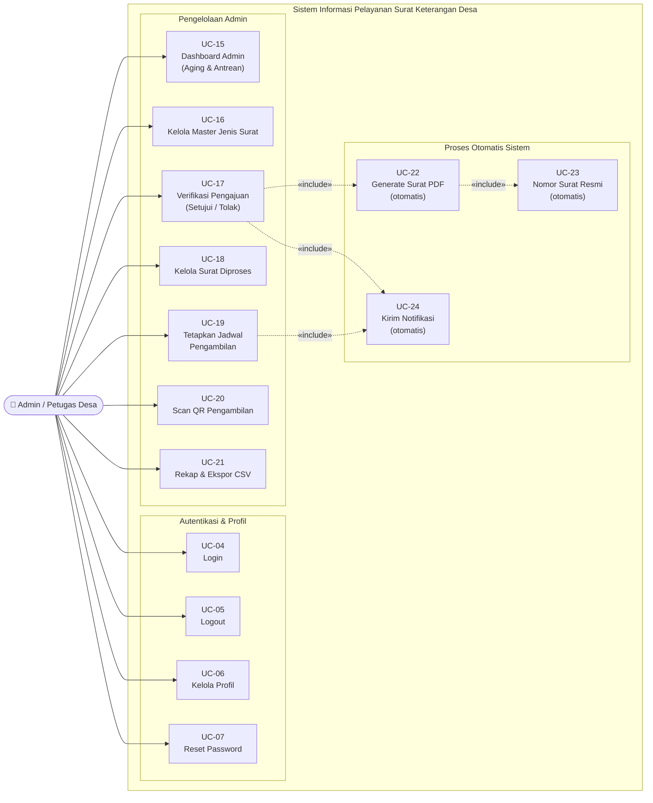

# Use Case Diagram — Admin / Petugas Desa

## Informasi Diagram

| Atribut | Nilai |
|---------|-------|
| **Kode** | UC-Admin |
| **Aktor** | Admin / Petugas Desa |
| **Deskripsi Aktor** | Operator desa yang mengelola pengajuan dan menerbitkan surat |

## Deskripsi

Diagram ini menampilkan seluruh use case yang dapat dilakukan oleh **Admin / Petugas Desa** setelah login. Admin bertanggung jawab mengelola master data, memverifikasi pengajuan warga, memproses surat, menetapkan jadwal pengambilan, memindai QR, dan melihat rekap pelaporan.

## Diagram Use Case

## Deskripsi Use Case

| Kode | Nama | Deskripsi | Activity Diagram |
|------|------|-----------|-----------------|
| UC-04 | Login | Admin memasukkan email dan password; sistem mengarahkan ke Dashboard Admin | [AD-02](../activity/ad-02-login-redirect-dashboard.md) |
| UC-05 | Logout | Admin mengakhiri sesi dan kembali ke beranda | — |
| UC-06 | Kelola Profil | Admin memperbarui nama, telepon, alamat, email, atau password | — |
| UC-07 | Reset Password | Admin meminta tautan reset password melalui email | [AD-03](../activity/ad-03-reset-password.md) |
| UC-15 | Dashboard Admin | Admin melihat kartu aging (Menunggu/Diproses/Siap Diambil/Selesai) dan daftar item mendesak | — |
| UC-16 | Kelola Master Jenis Surat | Admin menambah, mengubah, mengarsipkan, dan menghapus jenis surat | [AD-10](../activity/ad-10-kelola-jenis-surat.md) |
| UC-17 | Verifikasi Pengajuan | Admin memeriksa detail pengajuan, lalu menyetujui atau menolak | [AD-05](../activity/ad-05-verifikasi-pengajuan.md) |
| UC-18 | Kelola Surat Diproses | Admin memantau daftar surat yang sedang diproses | [AD-06](../activity/ad-06-proses-surat-jadwal-pengambilan.md) |
| UC-19 | Tetapkan Jadwal Pengambilan | Admin menetapkan tanggal pengambilan sesuai hari kerja | [AD-06](../activity/ad-06-proses-surat-jadwal-pengambilan.md) |
| UC-20 | Scan QR Pengambilan | Admin memindai QR sekali pakai saat warga datang mengambil surat | [AD-07](../activity/ad-07-scan-qr-pengambilan.md) |
| UC-21 | Rekap & Ekspor CSV | Admin memfilter rekap pengajuan dan mengunduh laporan CSV | [AD-11](../activity/ad-11-rekap-ekspor-csv.md) |
| UC-22 | Generate Surat PDF | Sistem membuat PDF otomatis saat admin menyetujui — `«include»` UC-17 | — |
| UC-23 | Nomor Surat Resmi | Sistem menghasilkan nomor surat resmi format `470/{urut}/DS-WDN/{romawi}/{tahun}` — `«include»` UC-22 | — |
| UC-24 | Kirim Notifikasi | Sistem mengirim notifikasi in-app ke warga — `«include»` UC-17, UC-19 | — |

## Relasi Antar Use Case

| Tipe | Sumber | Target | Penjelasan |
|------|--------|--------|------------|
| `«include»` | UC-17 Verifikasi Pengajuan | UC-22 Generate Surat PDF | Setiap persetujuan selalu memicu generate PDF |
| `«include»` | UC-22 Generate Surat PDF | UC-23 Nomor Surat Resmi | Setiap PDF selalu mendapat nomor surat resmi berurutan |
| `«include»` | UC-17 Verifikasi Pengajuan | UC-24 Kirim Notifikasi | Setujui/tolak selalu mengirim notifikasi ke warga |
| `«include»` | UC-19 Tetapkan Jadwal | UC-24 Kirim Notifikasi | Penetapan jadwal selalu mengirim notifikasi ke warga |

## Panduan Pengguna

| # | Panduan | Tautan |
|---|---------|--------|
| 1 | Login | [01-role-based-login.md](../../guides/admin/01-role-based-login.md) |
| 2 | Dashboard Admin | [02-dashboard-admin.md](../../guides/admin/02-dashboard-admin.md) |
| 3 | Kelola Jenis Surat | [03-jenis-surat.md](../../guides/admin/03-jenis-surat.md) |
| 4 | Verifikasi Pengajuan | [04-verifikasi-pengajuan.md](../../guides/admin/04-verifikasi-pengajuan.md) |
| 5 | Daftar Pengajuan & Alur Setujui | [05-daftar-pengajuan-dan-alur-setujui.md](../../guides/admin/05-daftar-pengajuan-dan-alur-setujui.md) |
| 6 | Generate Surat PDF | [06-generate-surat-pdf.md](../../guides/admin/06-generate-surat-pdf.md) |
| 7 | Nomor Surat Resmi | [07-nomor-surat-resmi.md](../../guides/admin/07-nomor-surat-resmi.md) |
| 8 | Surat Diproses | [08-surat-diproses.md](../../guides/admin/08-surat-diproses.md) |
| 9 | Dokumen Siap Diambil | [09-dokumen-siap-diambil.md](../../guides/admin/09-dokumen-siap-diambil.md) |
| 10 | Scan QR Pengambilan | [10-qr-sekali-pakai.md](../../guides/admin/10-qr-sekali-pakai.md) |
| 11 | Rekap Pengajuan | [11-rekap-pengajuan.md](../../guides/admin/11-rekap-pengajuan.md) |
| 12 | Migrasi Alur Status | [12-migrasi-alur-status.md](../../guides/admin/12-migrasi-alur-status.md) |
| 13 | Proteksi Akses | [13-role-middleware.md](../../guides/admin/13-role-middleware.md) |
| 14 | Manajemen Profil | [14-profile-management.md](../../guides/admin/14-profile-management.md) |
| 15 | Lupa Password | [15-password-reset.md](../../guides/admin/15-password-reset.md) |
