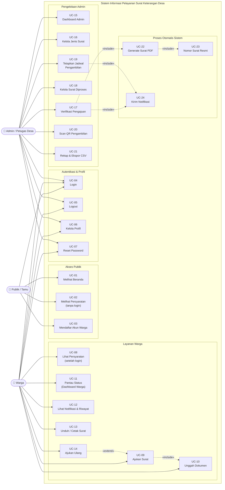

# Use Case Diagram — Gambaran Umum Sistem

## Informasi Diagram

| Atribut | Nilai |
|---------|-------|
| **Kode** | UC-Overview |
| **Nama** | Gambaran Umum Sistem |
| **Aktor** | Publik / Tamu, Warga, Admin / Petugas Desa |
| **Cakupan** | Seluruh fungsionalitas sistem |

## Deskripsi

Diagram ini menampilkan gambaran menyeluruh dari seluruh use case dalam Sistem Informasi Pelayanan Surat Keterangan Desa. Tiga aktor utama berinteraksi dengan sistem: Publik/Tamu (pengunjung tanpa akun), Warga (pengguna terdaftar), dan Admin/Petugas Desa (operator).

## Aktor

| Aktor | Deskripsi | Mewarisi dari |
|-------|-----------|---------------|
| **Publik / Tamu** | Pengunjung tanpa akun | — |
| **Warga** | Warga desa yang terdaftar | Semua akses Publik/Tamu |
| **Admin / Petugas Desa** | Operator desa | — |

## Diagram Use Case

## Daftar Use Case

| Kode | Nama | Aktor | Detail |
|------|------|-------|--------|
| UC-01 | Melihat Beranda | Publik/Tamu | [uc-publik.md](uc-publik.md) |
| UC-02 | Melihat Persyaratan (tanpa login) | Publik/Tamu | [uc-publik.md](uc-publik.md) |
| UC-03 | Mendaftar Akun Warga | Publik/Tamu | [uc-publik.md](uc-publik.md) |
| UC-04 | Login | Warga, Admin | [uc-warga.md](uc-warga.md) |
| UC-05 | Logout | Warga, Admin | [uc-warga.md](uc-warga.md) |
| UC-06 | Kelola Profil | Warga, Admin | [uc-warga.md](uc-warga.md) |
| UC-07 | Reset Password | Warga, Admin | [uc-warga.md](uc-warga.md) |
| UC-08 | Lihat Persyaratan (login) | Warga | [uc-warga.md](uc-warga.md) |
| UC-09 | Ajukan Surat | Warga | [uc-warga.md](uc-warga.md) |
| UC-10 | Unggah Dokumen | Warga | [uc-warga.md](uc-warga.md) |
| UC-11 | Pantau Status (Dashboard) | Warga | [uc-warga.md](uc-warga.md) |
| UC-12 | Lihat Notifikasi & Riwayat | Warga | [uc-warga.md](uc-warga.md) |
| UC-13 | Unduh / Cetak Surat | Warga | [uc-warga.md](uc-warga.md) |
| UC-14 | Ajukan Ulang | Warga | [uc-warga.md](uc-warga.md) |
| UC-15 | Dashboard Admin | Admin | [uc-admin.md](uc-admin.md) |
| UC-16 | Kelola Jenis Surat | Admin | [uc-admin.md](uc-admin.md) |
| UC-17 | Verifikasi Pengajuan | Admin | [uc-admin.md](uc-admin.md) |
| UC-18 | Kelola Surat Diproses | Admin | [uc-admin.md](uc-admin.md) |
| UC-19 | Tetapkan Jadwal Pengambilan | Admin | [uc-admin.md](uc-admin.md) |
| UC-20 | Scan QR Pengambilan | Admin | [uc-admin.md](uc-admin.md) |
| UC-21 | Rekap & Ekspor CSV | Admin | [uc-admin.md](uc-admin.md) |
| UC-22 | Generate Surat PDF | Sistem | [uc-admin.md](uc-admin.md) |
| UC-23 | Nomor Surat Resmi | Sistem | [uc-admin.md](uc-admin.md) |
| UC-24 | Kirim Notifikasi | Sistem | [uc-admin.md](uc-admin.md) |
