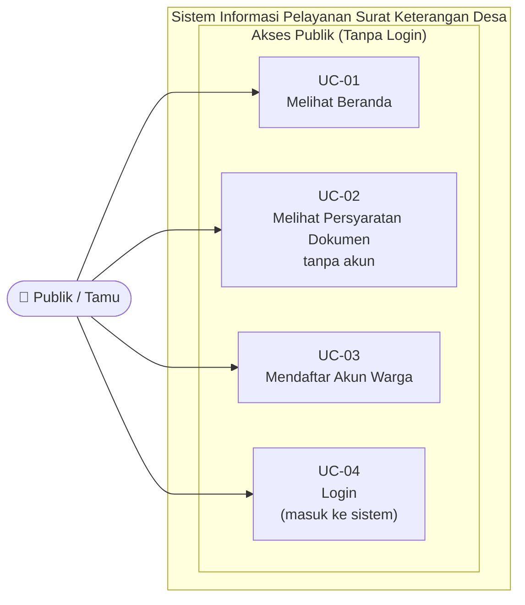

# Use Case Diagram — Publik / Tamu

## Informasi Diagram

| Atribut | Nilai |
|---------|-------|
| **Kode** | UC-Publik |
| **Aktor** | Publik / Tamu |
| **Deskripsi Aktor** | Pengunjung yang belum memiliki akun di sistem |

## Deskripsi

Diagram ini menampilkan seluruh use case yang dapat dilakukan oleh **Publik / Tamu** — yaitu siapa saja yang mengakses sistem tanpa login. Akses terbatas pada halaman informasi dan proses pembuatan akun.

## Diagram Use Case

## Deskripsi Use Case

| Kode | Nama | Deskripsi | Activity Diagram |
|------|------|-----------|-----------------|
| UC-01 | Melihat Beranda | Pengunjung membuka halaman utama, membaca informasi layanan, dan menemukan tombol Daftar/Masuk | — |
| UC-02 | Melihat Persyaratan Dokumen (tanpa login) | Pengunjung melihat daftar jenis surat dan dokumen yang perlu disiapkan sebelum mendaftar | — |
| UC-03 | Mendaftar Akun Warga | Pengunjung membuat akun baru dengan mengisi NIK, nama, telepon, alamat, email, dan password | [AD-01](../activity/ad-01-registrasi-akun-warga.md) |
| UC-04 | Login | Pengunjung memasukkan email dan password untuk masuk ke sistem | [AD-02](../activity/ad-02-login-redirect-dashboard.md) |

## Panduan Pengguna

| Panduan | Tautan |
|---------|--------|
| Beranda, Masuk, dan Daftar | [01-public-pages.md](../../guides/publik/01-public-pages.md) |
| Akses Publik Persyaratan Dokumen | [02-persyaratan-dokumen-publik.md](../../guides/publik/02-persyaratan-dokumen-publik.md) |
| Registrasi Akun Warga | [03-citizen-registration.md](../../guides/publik/03-citizen-registration.md) |
