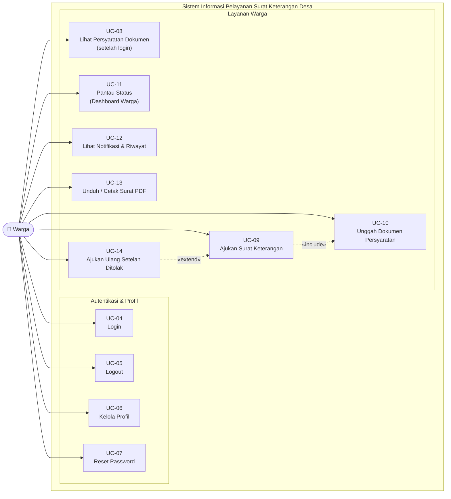

# Use Case Diagram — Warga

## Informasi Diagram

| Atribut | Nilai |
|---------|-------|
| **Kode** | UC-Warga |
| **Aktor** | Warga |
| **Deskripsi Aktor** | Warga desa yang sudah memiliki akun dan telah login |

## Deskripsi

Diagram ini menampilkan seluruh use case yang dapat dilakukan oleh **Warga** setelah login. Warga dapat mengajukan surat, memantau status, melihat notifikasi, mengunduh surat, dan mengajukan ulang jika ditolak.

## Diagram Use Case

## Deskripsi Use Case

| Kode | Nama | Deskripsi | Activity Diagram |
|------|------|-----------|-----------------|
| UC-04 | Login | Warga memasukkan email dan password; sistem mengarahkan ke Dashboard Warga | [AD-02](../activity/ad-02-login-redirect-dashboard.md) |
| UC-05 | Logout | Warga mengakhiri sesi dan kembali ke beranda | — |
| UC-06 | Kelola Profil | Warga memperbarui nama, telepon, alamat, email, atau password | — |
| UC-07 | Reset Password | Warga meminta tautan reset password melalui email | [AD-03](../activity/ad-03-reset-password.md) |
| UC-08 | Lihat Persyaratan Dokumen | Warga melihat daftar jenis surat dan dokumen yang diperlukan | — |
| UC-09 | Ajukan Surat Keterangan | Warga memilih jenis surat, mengisi keperluan, dan mengirim pengajuan | [AD-04](../activity/ad-04-pengajuan-surat.md) |
| UC-10 | Unggah Dokumen Persyaratan | Warga mengunggah KTP/KK (JPG/PNG/PDF maks. 2 MB) — `«include»` UC-09 | [AD-04](../activity/ad-04-pengajuan-surat.md) |
| UC-11 | Pantau Status (Dashboard Warga) | Warga melihat status pengajuan aktif, riwayat singkat, notifikasi terbaru | — |
| UC-12 | Lihat Notifikasi & Riwayat | Warga membuka panel notifikasi dan halaman riwayat semua pengajuan | — |
| UC-13 | Unduh / Cetak Surat PDF | Warga mengunduh atau mencetak PDF surat yang sudah diterbitkan | [AD-08](../activity/ad-08-unduh-cetak-surat.md) |
| UC-14 | Ajukan Ulang Setelah Ditolak | Warga mengajukan ulang pengajuan yang ditolak — `«extend»` UC-09 | [AD-09](../activity/ad-09-ajukan-ulang.md) |

## Relasi Antar Use Case

| Tipe | Sumber | Target | Penjelasan |
|------|--------|--------|------------|
| `«include»` | UC-09 Ajukan Surat | UC-10 Unggah Dokumen | Pengajuan selalu menyertakan langkah unggah jika jenis surat memerlukan KTP/KK |
| `«extend»` | UC-14 Ajukan Ulang | UC-09 Ajukan Surat | Pengajuan ulang memperluas alur pengajuan normal, dipicu jika status = Ditolak |

## Panduan Pengguna

| # | Panduan | Tautan |
|---|---------|--------|
| 1 | Login | [01-role-based-login.md](../../guides/warga/01-role-based-login.md) |
| 2 | Manajemen Profil | [02-profile-management.md](../../guides/warga/02-profile-management.md) |
| 3 | Lupa Password | [03-password-reset.md](../../guides/warga/03-password-reset.md) |
| 4 | Persyaratan Dokumen | [04-persyaratan-dokumen.md](../../guides/warga/04-persyaratan-dokumen.md) |
| 5 | Pengajuan Surat | [05-pengajuan-surat-form.md](../../guides/warga/05-pengajuan-surat-form.md) |
| 6 | Unggah Dokumen | [06-pengajuan-surat-dokumen.md](../../guides/warga/06-pengajuan-surat-dokumen.md) |
| 7 | Validasi Kelengkapan | [07-pengajuan-surat-kelengkapan.md](../../guides/warga/07-pengajuan-surat-kelengkapan.md) |
| 8 | Dashboard Warga | [08-dashboard-warga.md](../../guides/warga/08-dashboard-warga.md) |
| 9 | Notifikasi & Riwayat | [09-notifikasi-pengajuan.md](../../guides/warga/09-notifikasi-pengajuan.md) |
| 10 | Unduh/Cetak Surat | [10-unduh-surat-warga.md](../../guides/warga/10-unduh-surat-warga.md) |
| 11 | Ajukan Ulang | [11-pengajuan-surat-ajukan-ulang.md](../../guides/warga/11-pengajuan-surat-ajukan-ulang.md) |
| 12 | Proteksi Akses | [12-role-middleware.md](../../guides/warga/12-role-middleware.md) |
